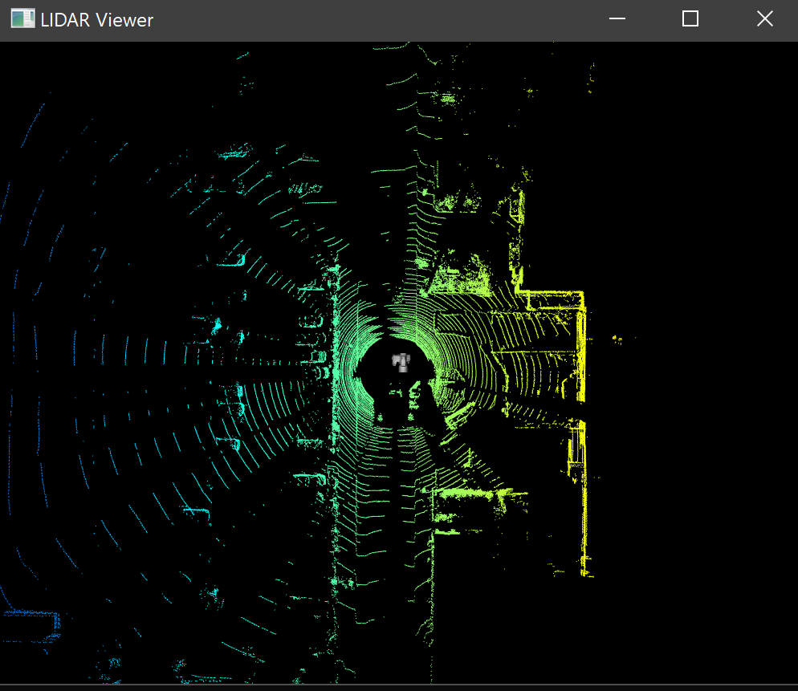
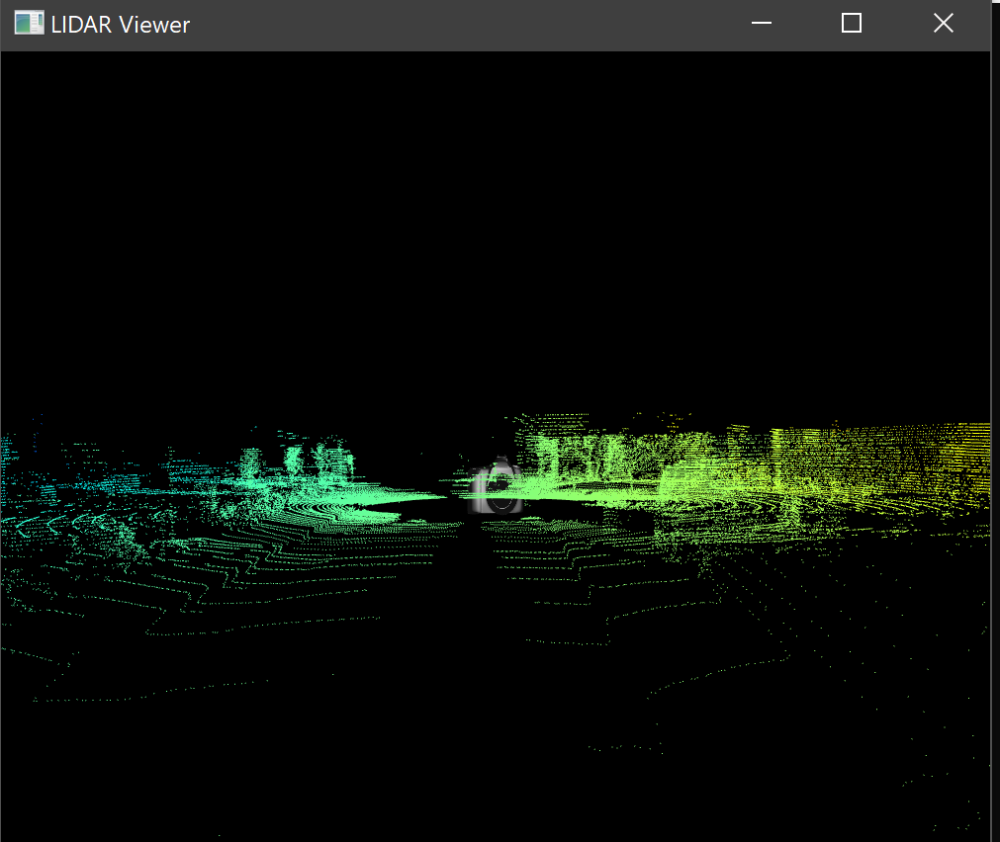

#### LIDAR Viewer

This project is a data visualizer for the [PeRL](http://robots.engin.umich.edu/SoftwareData/Ford) LIDAR dataset.

#### Dependencies

1. [glm](https://glm.g-truc.net/0.9.9/index.html) 
2. [glfw](https://www.glfw.org/)
3. [glew](http://glew.sourceforge.net/)
4. [boost 1.6.60](https://www.boost.org/)

#### Installation instructions

This project uses cmake 3.8 as a result, generating makefiles is a platform agnistic process.

##### Windows
1. Edit the `CMakeLists.txt` set the `BOOST_ROOT` `BOOST_LIBRARYDIR` and `BOOST_INCLUDEDIR` equal to the location of your boost installation. [These (section 5.2.1, steps 1-3)](https://www.boost.org/doc/libs/1_62_0/more/getting_started/windows.html) are the steps I followed while installing boost on my Windows 10. 
2. Run `cmake .` in powershell. The `.sln` file fow the project will be generated. 
3. Right click and build the `ALL_BUILD` file generated in step 2.
4. The binary will be output in lidar-viewer/lib directory.

##### Linux

##### Controls
1. W, S: to move the camera along the screen Y axis, pointcloud Z axis.
2. Q, A: to move the camera along the screen Z axis, pointcloud Y axis.
3. Z, D: to move the camera along the screen X axis, pointcloud X axis.
3. Up, Down: to increase/decrease pitch of the camera.
4. Left, Right: to increase/decrease yaw of the camera.
5. N: advance to the next scan of the pointcloud.

##### Screens

##### Learning goals accomplished

1. __GLSL Programming__: Every calculation in this project is performed through vertex and fragment shaders. This has allowed me tremendous control over every data point in my models and dataset. (PS lidar-viewer/src/glsl/\* and pcobject.cpp, slrobject.cpp)
2. __Camera Object__: As a consequence of using shaders, every data point is converted from 3D world space to 2D raster coordinates (prespective projection) by simply multiplying each vector with matrices. This has allowed me to gain an intuitive understanding of projection, view and model matrices.

##### Goals pending

0. __Minimap for the camera__: It is difficult to keep track of camera location while moving it around to explore the point cloud. The minimap is a work in progress. The approach I have identified is to offset the world camera movement by using the camera.positionVector to translate the viewMatrix of slrCamera object.
1. __CUDA Interop__: Integrating CUDA for parallel proessing of every one of 70000+ data points. I have prior CUDA [https://github.com/KaunilD/cuda_cv](experience) so that will be handy in the integration.
